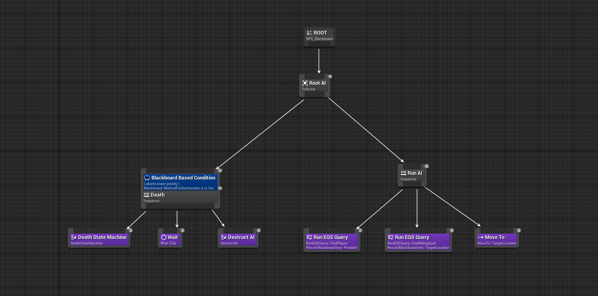

# IA_HideAndSeek_UE5

## Build

[Package project](https://drive.google.com/file/d/1j21E6Ccq17z0X1FwSZwn3FBnxo9qvB2C/view?usp=sharing)

## Presentation

The goal of the exercise was to program a Bot under Unreal 5 capable of
to hide itself automatically. I found this topic interesting because AIs are an integral part of
are an integral part of video games, so it is essential to know how to program
to program AI in modern games. The project I designed based on the
the given subject is an evolution on the level of the game design as well as on the
as well as on the artistic side. I was inspired by my personal and professional experiences
and professional experiences to carry out this project. This project
reminded me a lot of Duck Hunt on NES, so I was a bit inspired by it to
inspired to develop my project. The gameplay is simple, you just have to kill
just kill as many deer as possible.

## Technology used

- Behavior Tree de l’AI
- Environnement Query System
- AICharacter / FirstPersonCharacter
- AIController / FirstPersonController
- Anim Instance
- UI Widget
- GameMode
- Tasks et Test pour l’IA
- Ballistic
- LifeComponent

## Detailed architecture

### IA

AICharacter and AIController, are the master classes of the AI, at spawn the
controller we run the Behaviour Tree "NPC_BT".

The BT is simple, in the left part if the AI has no more life it dies
dies. It is a condition triggered by the AICharacter which sets the
variable "MarkedForDestruction" of the blackboard to true and that triggers
the rest of the BT. We then send the info to the animation graph which plays
the death animation, we wait 5 seconds and we destroy the AActor.

Right part, we have an EQS Query that searches on the player see the AI
with a LineTrace.

If a player is found, the AI is ordered to look for a new
a new hiding place.

Detail: We generate a grid with a radius of 3000 and an offset of 500
around the AI, we make a trace for each live position of the player,
to find the points where the player does not see us, we assign scores to each position.
scores to each position. The farther the positions are from the player and the closer
to us the higher the score is. We look if this point is on the navmesh
and if it is accessible by the AI. Then we give a score if the rotation
is not too big, so that it does not turn completely. And
finally we look if the point is visible by the AI.
All these tests are classes in C++ "EnvQueryTest" coded by me
myself or for a hundred already present in the engine.
Once the point is found the AI performs a MoveTo following the NavMesh.

### Animation IA

It's an anim graph with a state machine, with 3 variables
(IsRunning, Speed, IsDead), I added a 2D blenspace and a cache
to make the hit effect, which is managed with an AnimMontage we receive a
hit.

### Player

The player can fire a weapon towards the center of the camera,
an AAttackBallistic is then spawned at the end of the weapon, it advances in
forward and when it detects something in its collision capsule it applies
collision capsule she applies damage to it. I don't pass one for
UGameplayStatics::ApplyDamage.

### Animation Player

I use an AnimMontage for the fire shot. Since I changed the
model of the weapon and that the weapon is thinner than the one planned by the
the animation, I added some IK to snapper the hand on the weapon and
make the render more beautiful and realistic.

### Life Component

ULifeComponent is a UActorComponent that has been added to the
player and on the AI and which allows to manage directly its life points.
Each time the AI receives damage in the TakeDamage,
it is the LifeComponent that manages all the player's hit points. This
allows a more modular code and the possibility to reuse this
component on all objects that need to have life points.
When the hit points fall to 0, a delegate is called to
allow all the actors listening to this callback to take an action.

### Data

I used UDataAsset, to simplify the life of
life of the Game Designer and not to have to
enter in Blueprint or even worse in
C++. There is one point of damage of the weapon and one
for the AI's life points.

### GameMode

For a more fun gameplay, I added a scoring logic that when an AI is dead
that when an AI is dead it increases the score by 1 and spawns another AI in a
spawn another AI in a new place of the map. The locations of
spawn locations are retrieved from the GameMode spawn. These are
ATargetPoint placed directly in the scene.

### UI

The ui is directly done in UMG from the BP, it only displays the
score, and is refresh only when an AI dies.

### Toolbox

UToolbox is a class that allows you to do things that I often need in my
I often need in my projects.

## Class diagram

## Art and LD

I got some packs from the marketplace to make the scene look
pretty scene. One of them was a pack of animals with animations. I then
did the level design in a separate scene. And then I did the Level Art
in the Art scene and the gameplay objects in the GP scene.
